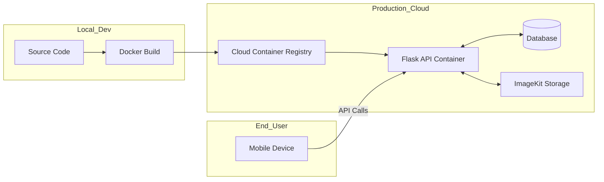

# Deployment and Maintenance

The deployment and maintenance of the Sprinter Analysis platform ensure that the application is accessible, performant, and secure for its users. This section details the production strategy, the containerization process, and the ongoing upkeep of the system.

---

## 1. Deployment Strategy

The project employs a **Modern Cloud-Native Deployment** strategy, separating the backend processing engine from the frontend mobile client to ensure independent scaling and high availability.

### 1.1 Containerization with Docker
To eliminate the "it works on my machine" problem, the backend is containerized using **Docker**. This ensures that the Python environment, OpenCV dependencies (such as `libgl1`), and machine learning libraries (MediaPipe, Scikit-learn) behave identically across development and production environments.

- **Base Image:** `python:3.10-slim` for a lightweight footprint.
- **Dependencies:** Pre-installed system libraries for video processing (`libglib2.0-0`) and the full suite of Python requirements.
- **Port Mapping:** The application exposes port **5000** for handle incoming API requests from the mobile frontend.

### 1.2 Backend Deployment (Provisioning)
The Dockerized backend can be deployed to various cloud platforms:
- **Cloud Providers:** **AWS (App Runner or ECS)**, **DigitalOcean (App Platform)**, or **Render**.
- **Static IP/Domain:** A fixed endpoint is configured so that the mobile app can consistently communicate with the API without needing manual IP updates.
- **Environment Management:** Sensitive data—including **ImageKit Keys**, **JWT Secret Keys**, and **Database Credentials**—are managed via **Environment Variables**, ensuring security and flexibility.

### 1.3 Frontend Deployment (Expo/Mobile)
The mobile application is deployed using **Expo Application Services (EAS)**:
- **Build Process:** EAS Build generates optimized `.apk` (Android) and `.ipa` (iOS) binaries.
- **OTA Updates:** Expo’s "Over-The-Air" update capability allows for quick UI fixes and logic updates without requiring users to download a new version from the app store.

---

## 2. Maintenance Protocol

A specialized biomechanics application requires proactive maintenance to ensure the mathematical accuracy of its analysis over time.

### 2.1 Corrective & Adaptive Maintenance
- **Error Tracking:** Implementing logging (e.g., using Python’s `logging` module or Sentry) to catch "Failed to Process Video" errors that may occur due to unusual video codecs or extreme lighting conditions.
- **OS Updates:** Regularly updating the React Native and Expo versions to maintain compatibility with updated Android and iOS hardware/software features (like Camera APIs).

### 2.2 Model & Data Maintenance
- **Model Drift Monitoring:** Periodically checking if the predictive targets remain accurate against new athletic standards.
- **Incremental Training:** As the user base grows, the system is designed to allow "Anonymized Data Collection," where new high-quality sprint data can be used to retrain the **Multivariate Regression** model for even higher precision.
- **Database Housekeeping:** Automated scripts to back up the SQLite/PostgreSQL database and prune temporary uploaded videos from the server to optimize storage costs.

### 2.3 Security Maintenance
- **JWT Rotation:** Ensuring that authentication tokens are periodically invalidated to prevent long-term session hijacking.
- **Package Audits:** Running `npm audit` and `pip list --outdated` monthly to patch any discovered vulnerabilities in the project's many dependencies.

---

## 3. Production Workflow Diagram

---

## 4. Maintenance Checklist for Future Versions
| Task | Frequency | Objective |
| :--- | :--- | :--- |
| **Log Review** | Weekly | Identify and fix recurring video processing failures. |
| **Model Retraining** | Quarterly | Improve prediction accuracy with new data. |
| **Security Patching** | Monthly | Update third-party libraries (OpenCV, Flask, etc.). |
| **Database Backup** | Daily | Ensure data recovery in case of server failure. |
| **UI/UX Cleanup** | As Needed | Refine feedback based on athlete/coach reviews. |

---
